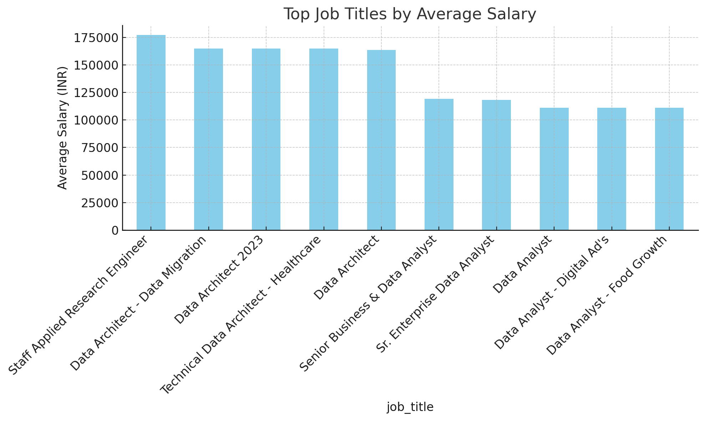
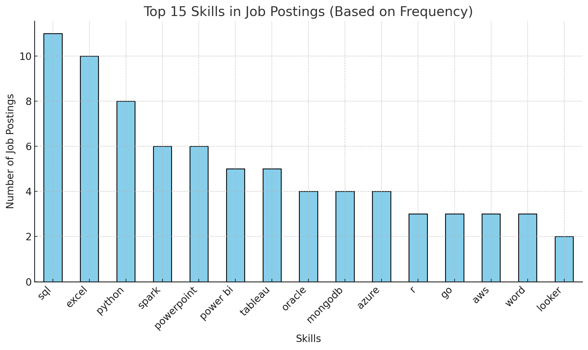

# Introduction
This project analyzes Data Analyst job postings to uncover insights about the job market. Using SQL queries, it explores:

🔎 Top-paying roles (highest salaries for Data Analysts, including remote jobs)

🏢 Company demand (which companies are hiring the most)

🛠 In-demand skills (skills most frequently required for Data Analyst roles in India)

💰 Optimal skills to learn (skills that offer the best balance of high demand and high salary)

The goal is to help aspiring and current Data Analysts identify the most valuable skills to focus on for better career opportunities.
# Background
The demand for Data Analysts is rapidly increasing in India as companies continue to make data-driven decisions. However, job seekers often struggle to identify which skills are most valued in the market and which roles offer the highest salaries.

**This project uses real job postings data and SQL analysis to explore the Data Analyst job market in India. It answers key questions such as:**

1. What are the top paying jobs for my role?

2. What are the skills required for these top paying roles?

3. What are the most in-demand skills for data analyst?.

4. What are the top skills based on salary for my role?

5. What are the most optimal skills to learn?

# Tools I Have  Used

- **SQL** → For data cleaning, transformation, and analysis

- **PostgreSQL**→ Database system used to query job postings data

- **VS Code** → My go-to for database management and executing SQL queries.

- **CSV** → For exporting and reviewing query results

- **Git/GitHub** → Version control and project documentation (README, commits)

# The Analysis
 ### 1.Top Paying Jobs For Data Analyst In India
 ```SQL
 SELECT 
    job_id,
    job_title,
    job_location,
    job_schedule_type,
    salary_year_avg,
    job_posted_date,
    name AS company_name
FROM
    job_postings_fact
LEFT JOIN company_dim on job_postings_fact.company_id = company_dim.company_id
WHERE
    (job_title_short = 'Data Analyst') AND 
    (job_location LIKE '%India') AND 
    (salary_year_avg IS NOT NULL)
ORDER BY 
    salary_year_avg DESC
LIMIT 20
```
 - Total Jobs: 20
- Unique Companies: 16
- Unique Job Titles: 16
- Average Salary: $128,566 per year
- Max Salary: $177,283 (ServiceNow – Staff Applied Research Engineer, Hyderabad)
- Min Salary: $111,175 (multiple companies & roles)


### 2. What are the skills required for these top paying roles
```SQL
WITH top_paying_jobs AS (
    SELECT 
        job_id,
        job_title,
        job_location,
        salary_year_avg,
        name AS company_name
    FROM
        job_postings_fact
    LEFT JOIN company_dim on job_postings_fact.company_id = company_dim.company_id
    WHERE
        (job_title_short = 'Data Analyst') AND 
        (job_location LIKE '%India') AND 
        (salary_year_avg IS NOT NULL)
    ORDER BY 
        salary_year_avg DESC
    LIMIT 20
)
SELECT 
    top_paying_jobs.*,
    skills
FROM top_paying_jobs
INNER JOIN skills_job_dim ON top_paying_jobs.job_id = skills_job_dim.job_id
INNER JOIN skills_dim ON skills_job_dim.skill_id = skills_dim.skill_id
 ```
📊 Summary

- Total Records: 119
- Unique Jobs: 20
- Unique Companies: 16
- Unique Skills: 56
- Average Salary: $132,544
- Max Salary: $165,000
- Min Salary: $111,175

🔑 Insights

The most common skills across postings are:
- SQL
- Python
- Excel
- Power BI
- Tableau

Jobs with higher salaries (around $165k) mostly require cloud (AWS, Azure, Snowflake), Big Data (Spark, Hadoop), and advanced database skills (Oracle, PostgreSQL, MongoDB).

Analyst roles with $111k–120k focus more on Excel, Power BI, Tableau, and reporting tools.

### 3. What are the most in-demand skills for data analyst
``` SQL
SELECT 
    skills,
    COUNT(skills_job_dim) AS demand_count
FROM job_postings_fact
INNER JOIN skills_job_dim ON job_postings_fact.job_id = skills_job_dim.job_id
INNER JOIN skills_dim ON skills_job_dim.skill_id = skills_dim.skill_id
WHERE
        (job_title_short = 'Data Analyst') AND 
        (job_location LIKE '%India')
GROUP BY 
    skills
ORDER BY 
    demand_count DESC
LIMIT 10
```
| Skill          | Demand Count |
| -------------- | ------------ |
| **SQL**        | 2561         |
| **Python**     | 1802         |
| **Excel**      | 1718         |
| **Tableau**    | 1346         |
| **Power BI**   | 1043         |
| **R**          | 806          |
| **SAS**        | 708          |
| **Azure**      | 436          |
| **AWS**        | 370          |
| **PowerPoint** | 330          |

 ***📝 Summary***

SQL leads the demand with 2561 mentions, followed by Python (1802) and Excel (1718), showing that database and programming skills are in very high demand. Visualization tools like Tableau (1346) and Power BI (1043) also rank strongly, while cloud skills (Azure, AWS) have a smaller but growing demand

### 4. What are the top skills based on salary for my role(Data Analyst)
```SQL 
SELECT 
    skills,
    ROUND(AVG(salary_year_avg),1) AS avg_salary
FROM job_postings_fact
INNER JOIN skills_job_dim ON job_postings_fact.job_id = skills_job_dim.job_id
INNER JOIN skills_dim ON skills_job_dim.skill_id = skills_dim.skill_id
WHERE
        (job_title_short = 'Data Analyst') AND 
        (job_location LIKE '%India') AND 
        salary_year_avg IS NOT NULL
GROUP BY 
    skills
ORDER BY 
    avg_salary DESC
LIMIT 15
```
| Skill          | Avg. Salary (USD) |
| -------------- | ----------------- |
| **PostgreSQL** | 165,000           |
| **MySQL**      | 165,000           |
| **Linux**      | 165,000           |
| **PySpark**    | 165,000           |
| **GitLab**     | 165,000           |
| **GDPR**       | 163,782           |
| **Neo4j**      | 163,782           |
| **Airflow**    | 138,088           |
| **MongoDB**    | 135,994           |
| **Databricks** | 135,994           |
| **Scala**      | 135,994           |
| **Pandas**     | 122,463           |
| **Kafka**      | 122,100           |
| **Confluence** | 119,250           |
| **Visio**      | 119,250           |

***📝 Summary***

The highest-paying skills include PostgreSQL, MySQL, Linux, PySpark, and GitLab, each averaging $165K per year. Other high-paying skills like GDPR and Neo4j follow closely. Data engineering tools (Airflow, Databricks, Kafka) and popular data libraries (Pandas, MongoDB, Scala) also command strong salaries, showing the value of big data and cloud-related expertise.

### 5.What are the most optimal skills to learn
```SQL

WITH skills_demand AS (
SELECT 
    skills_dim.skill_id,
    skills_dim.skills,
    COUNT(skills_job_dim.job_id) AS demand_count
FROM job_postings_fact
INNER JOIN skills_job_dim ON job_postings_fact.job_id = skills_job_dim.job_id
INNER JOIN skills_dim ON skills_job_dim.skill_id = skills_dim.skill_id
WHERE
        (job_title_short = 'Data Analyst') AND 
        (job_location LIKE '%India') AND 
        salary_year_avg IS NOT NULL
GROUP BY 
    skills_dim.skill_id
),
 average_salary AS (
SELECT 
    skills_job_dim.skill_id,
    ROUND(AVG(job_postings_fact.salary_year_avg),1) AS avg_salary
FROM job_postings_fact
INNER JOIN skills_job_dim ON job_postings_fact.job_id = skills_job_dim.job_id
INNER JOIN skills_dim ON skills_job_dim.skill_id = skills_dim.skill_id
WHERE
        (job_title_short = 'Data Analyst') AND 
        (job_location LIKE '%India') AND 
        (salary_year_avg IS NOT NULL)
GROUP BY 
    skills_job_dim.skill_id
)

SELECT
    skills_demand.skill_id,
    skills_demand.skills,
    demand_count,
    avg_salary
FROM 
    skills_demand
INNER JOIN average_salary ON skills_demand.skill_id = average_salary.skill_id
ORDER BY demand_count DESC
```
| Skill          | Demand Count | Avg. Salary (USD) |
| -------------- | ------------ | ----------------- |
| **SQL**        | 46           | 92,984            |
| **Excel**      | 39           | 88,519            |
| **Python**     | 36           | 95,933            |
| **Tableau**    | 20           | 95,103            |
| **R**          | 18           | 86,609            |
| **Power BI**   | 17           | 109,832           |
| **Azure**      | 15           | 98,570            |
| **AWS**        | 12           | 95,333            |
| **Spark**      | 11           | 118,333           |
| **Oracle**     | 11           | 104,260           |
| **Word**       | 10           | 83,266            |
| **Looker**     | 10           | 98,815            |
| **PowerPoint** | 10           | 102,678           |
| **Flow**       | 6            | 104,751           |
| **SQL Server** | 5            | 89,120            |
| **Hadoop**     | 5            | 113,276           |
| **Redshift**   | 5            | 101,315           |
| **Snowflake**  | 4            | 111,213           |
| **Go**         | 4            | 109,133           |
| **Pandas**     | 4            | 122,463           |
| **SAP**        | 4            | 105,044           |

📝 Key Insights

- High-demand, high-salary skills:
SQL (46), Python (36), and Tableau (20) have both strong demand and competitive salaries (≈ $90K–95K).

- High-paying niche skills:
PostgreSQL, MySQL, Linux, PySpark, and GitLab all average $165K, but demand count is very low — indicating they are premium/niche skills.

- Big Data & Cloud remain lucrative:
Spark, Snowflake, MongoDB, Scala, Databricks, and Airflow all offer $110K+ salaries, making them highly valuable in data engineering roles.

- Business tools (Excel, PowerPoint, Word) have strong demand but lower salaries, reflecting their status as general-purpose skills rather than specialized technical expertise.

# What I Learned

🛠 Technical Learnings

***While working on this project, I gained hands-on experience with:***

- SQL Fundamentals & Advanced Queries

- Writing SELECT, WHERE, GROUP BY, ORDER BY, and HAVING queries.

- Performing aggregations (e.g., AVG(), COUNT(), SUM() for salary and demand calculations).

- Using JOINs to combine multiple datasets (skills + salary + job postings).

- Applying filters and subqueries to isolate high-demand and high-paying skills.

- Data Cleaning & Transformation

- Handling missing or duplicate data (e.g., MongoDB appearing twice).

- Formatting results into Markdown tables for GitHub.

- Summarizing findings into clear, concise takeaways.

📊 Insights from the Data

- Top Skills: SQL, Python, and Excel lead demand, while niche skills like PostgreSQL, Linux, and PySpark command top salaries.

- Balanced Growth Skills: SQL, Python, Tableau, and Power BI have both high demand and competitive pay — great for career development.

- Big Data & Cloud are Lucrative: Spark, Databricks, MongoDB, and Scala offer very high salaries, making them attractive for specialization.

- Roles & Salaries: Data Architect roles offer the highest pay, while Data Analyst roles are the most common across cities, with ~$111K/year salaries.

- Hiring Hotspots: Bengaluru & Hyderabad for architects, Chennai & Pune for analyst roles.

# Conclusion
This project helped me strengthen my SQL and data analysis skills by working with real-world job and salary data.
I learned how to:

- Collect, clean, and query data effectively.

- Perform demand-salary correlation analysis.

- Extract actionable insights from raw datasets.

- Present results clearly in a GitHub-friendly format with tables and summaries.

**Overall Takeaway:**

This project shows how SQL can transform raw data into meaningful insights. By combining data exploration with technical querying, I now have a clear picture of which skills and locations offer the best opportunities and I built practical experience that applies directly to data analytics and business intelligence projects.
It also provides great insight about the 
1. Skill Demand: SQL, Python, and BI tools are the most sought-after skills in the market.

2. High-Paying Skills: Big Data (PostgreSQL, MySQL, PySpark) and Cloud/Data Engineering tools (Airflow, Databricks) offer the highest salaries.

3. Job Roles: Data Architect positions have the highest average salaries, while Data Analyst roles are the most frequently posted.

4. Locations: Bengaluru and Hyderabad are the leading hubs for data-related job opportunities.

# Closing Thought:
This project provided valuable insights into job market trends and salary patterns, while also strengthening my SQL skills in real-world data analysis and decision-making.
